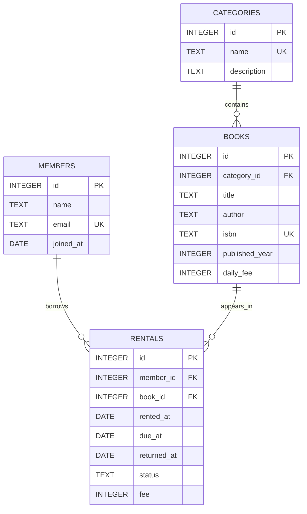

# B5-1 학습 노트 — 학습 도서 대여 DB

이 문서는 현재 구현(`sql/01_schema.sql`, `sql/02_seed.sql`, `sql/03_queries.sql`)을 기준으로 평가 때 설명할 수 있도록 정리한 학습 자료다.

## 1. 한 문장 요약

관계형 DB는 데이터를 한 표에 모두 복사해 넣는 대신, 역할별 table로 나누고 PK/FK와 constraint로 관계와 규칙을 보장한 뒤 JOIN·GROUP BY·subquery로 필요한 정보를 다시 조합한다.

## 2. 현재 스키마



### table을 나눈 이유

| Table | 역할 | 따로 둔 이유 |
|---|---|---|
| `categories` | 도서 분류 기준 | category 이름을 book마다 반복 저장하지 않고 하나의 기준값으로 관리한다. |
| `members` | 회원 기준 정보 | 대여가 여러 번 생겨도 이름·이메일을 rental마다 반복하지 않는다. |
| `books` | 도서 기준 정보 | 제목/저자/ISBN은 대여 사건과 수명이 다르므로 기준 정보로 분리한다. |
| `rentals` | 누가 어떤 책을 언제 빌렸는지 기록하는 사건 | member와 book 사이에서 반복 발생하는 거래/이력을 독립적으로 기록한다. |

## 3. PK, FK, 1:N을 내 스키마로 설명하기

- **PK(Primary Key, 기본키)**: 한 table에서 한 행을 유일하게 식별한다. 예: `members.id`.
- **FK(Foreign Key, 외래키)**: 다른 table의 PK를 참조해 관계를 만든다. 예: `rentals.member_id → members.id`.
- **1:N(일대다)**: 한 부모 행이 여러 자식 행과 연결된다.
  - 한 category에는 여러 book이 들어갈 수 있다.
  - 한 member는 여러 rental을 가질 수 있다.
  - 한 book도 시간에 따라 여러 rental 기록에 등장할 수 있다.

`evidence/constraints.txt`에서 존재하지 않는 `member_id=999`를 rental에 넣는 시도가 `FOREIGN KEY constraint failed`로 차단된 것을 확인할 수 있다. 즉, 관계는 단순한 숫자 약속이 아니라 DB constraint로 보장된다.

## 4. 컬럼 타입을 이렇게 선택한 이유

- `INTEGER`: id, 연도, 금액처럼 정수 연산/비교가 필요한 값.
- `TEXT`: 이름, 제목, 이메일, ISBN, 상태처럼 문자열로 다루는 값.
- `DATE`: SQLite에는 강제 DATE storage class가 따로 없지만 이 미션에서는 `YYYY-MM-DD` 형식의 날짜 의미를 명시하기 위해 선언했다. 날짜 문자열을 ISO 순서로 저장하면 범위 비교와 정렬을 이해하기 쉽다.
- `returned_at`은 아직 반납하지 않은 대여가 있으므로 NULL을 허용한다.

## 5. Constraint가 필요한 이유

`sql/01_schema.sql`은 다음을 적용한다.

- `NOT NULL`: 반드시 있어야 하는 값 차단. 예: `categories.name`.
- `UNIQUE`: 중복되어서는 안 되는 식별성 있는 값 차단. 예: `members.email`, `books.isbn`.
- `FOREIGN KEY`: 존재하지 않는 부모 참조 차단.
- `CHECK`: 허용 상태, 연도 범위, 음수 fee 같은 잘못된 값을 차단.

SQLite는 연결마다 FK 검사를 켜야 하므로 `PRAGMA foreign_keys = ON;`을 명시했다. 이 부분은 SQLite 전용 동작이다.

## 6. INNER JOIN과 LEFT JOIN 차이

### INNER JOIN — Q05/Q06

양쪽 table에 연결되는 행이 있을 때만 결과에 남는다.

예: Q06은 `books.category_id = categories.id`로 실제 category가 있는 book만 조합한다. FK가 보장되므로 현재 seed에서는 모든 book이 정상 연결된다.

### LEFT JOIN — Q07/Q09

왼쪽 table 행은 관계가 없어도 유지한다.

Q07은 `members LEFT JOIN rentals`이므로 대여가 한 번도 없는 `Oh Nari`, `Seo Jun`도 `rental_count = 0`으로 보인다. INNER JOIN을 쓰면 이 두 회원은 결과에서 사라진다.

## 7. GROUP BY와 집계 함수

- Q09: 회원별 `COUNT(r.id)` → 회원별 대여 횟수.
- Q10: category별 `SUM(r.fee)` → category별 누적 대여 수익.
- Q11: status별 `AVG(fee)` → 상태별 평균 fee.

`GROUP BY`는 여러 행을 지정한 기준으로 묶고, `COUNT/SUM/AVG`는 각 묶음에서 하나의 요약값을 계산한다.

## 8. Subquery를 쓴 이유 — Q12

목표는 **한 번도 대여하지 않은 회원** 찾기다.

```sql
WHERE NOT EXISTS (
    SELECT 1
    FROM rentals AS r
    WHERE r.member_id = m.id
)
```

각 member에 대해 연결된 rental이 하나라도 있는지 확인하고, 없을 때만 남긴다. 실제 결과는 member 11, 12 두 명이다.

## 9. UPDATE / DELETE의 의미

- Q13 `UPDATE`: rental 8의 상태를 `rented → returned`로 바꾸고 반납일을 기록한다.
- Q14 `DELETE`: 잘못 들어간 rental 18을 삭제하고 `COUNT(*) = 0`으로 사라졌음을 확인한다.

둘 다 실행 뒤 SELECT로 결과를 다시 확인해 Evidence에 남긴다.

## 10. Index를 어디에 걸었고 왜 그런가 — Q15

```sql
CREATE INDEX idx_rentals_status_due_at
ON rentals(status, due_at);
```

Q03/Q08은 active rental을 `status`로 찾고 만기일을 확인하는 흐름이므로 `(status, due_at)`을 선택했다. Evidence의 `EXPLAIN QUERY PLAN`에는 다음과 같이 index 사용이 확인된다.

```text
SEARCH rentals USING COVERING INDEX idx_rentals_status_due_at (status=?)
```

Index는 검색을 빠르게 할 수 있지만 별도 구조를 유지해야 하므로 모든 컬럼에 무조건 만드는 것이 아니라 자주 찾는 조건과 연결해서 선택한다.

## 11. 가장 복잡했던 Query — Q10 단계별 설명

목표: **category별 total fee**.

1. `categories`에서 category 이름을 시작점으로 잡는다.
2. `books.category_id`로 category와 book을 연결한다.
3. `rentals.book_id`로 book과 rental을 연결한다.
4. `GROUP BY c.id, c.name`으로 category 단위로 묶는다.
5. `SUM(r.fee)`로 각 group의 총 fee를 계산한다.
6. `ORDER BY total_fee DESC`로 큰 값부터 본다.

세 table을 연결한 뒤 집계한다는 점 때문에 단일 table SELECT보다 사고 단계가 많다.

## 12. 미션에서 어려웠던 부분과 해결

### 어려움

SQLite는 FK 문법을 선언해도 연결에서 foreign key enforcement가 꺼져 있으면 잘못된 참조가 통과할 수 있다. 단순히 schema에 `FOREIGN KEY`가 보인다고 실제로 동작한다고 가정하면 평가의 "없는 값 참조가 실제로 막히는가"를 증명하지 못한다.

### 해결

1. schema와 verifier 연결에서 `PRAGMA foreign_keys = ON`을 명시했다.
2. 검증 script에서 존재하지 않는 member를 참조하는 rental INSERT를 실제로 시도했다.
3. `FOREIGN KEY constraint failed`가 발생해야 PASS하도록 만들었다.
4. UNIQUE/NOT NULL/CHECK도 같은 방식으로 실패를 실제 검증했다.

## 13. DB와 Excel을 비교해 말하기

Excel은 한 화면에서 표를 빠르게 만들고 사람이 직접 편집하기 좋다. 이 미션에서 중요한 차이는 **DB가 관계와 무결성 규칙을 schema 수준에서 강제할 수 있다는 점**이다.

예를 들어 rental에 존재하지 않는 member를 입력하면 DB의 FK가 차단한다. 또한 category/member/book을 별도 table로 관리해 반복 데이터를 줄이고, JOIN으로 필요할 때 다시 조합한다.

## 14. 재현 순서

```text
01_schema.sql
   ↓
02_seed.sql
   ↓
03_queries.sql
   ↓
scripts/verify.py
   ↓
evidence/*.txt
```

실행:

```bash
python3 scripts/verify.py
```

평가 준비 시에는 먼저 `evidence/query-results.txt`의 Q05~Q12를 보면서 위 설명을 자기 말로 다시 말해보는 것이 핵심이다.
