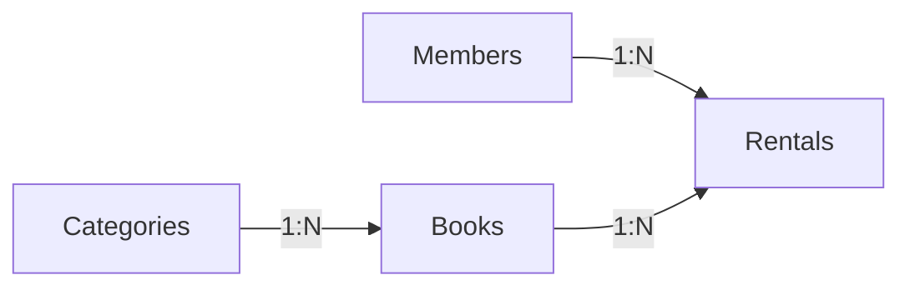

# B5-1 Round 01 — Beginner Guide

구분: **필수 미션 (REQUIRED)**  
Phase: **A — REFERENCE BUILD**  
Runtime Mission 상태: **⬜ NOT STARTED**

이 가이드는 공식 `b5-1-mission.md`와 `b5-1-evaluation.md`를 기준으로 B5-1을 처음 접하는 학습자가 Phase C에서 한 단계씩 실행할 수 있도록 만든 기준 경로입니다. Reference가 준비되어도 실제 SQLite 실행과 Evidence 전에는 `✅ CLEAR`가 아닙니다.

## 00. 미션 한눈에 보기

B5-1은 **도서 대여 관리 데이터베이스**를 SQL만으로 설계하는 미션입니다.

```text
요구사항 이해
→ 테이블/관계 설계
→ schema.sql
→ seed.sql
→ SELECT/JOIN/GROUP BY/Subquery
→ UPDATE/DELETE
→ INDEX
→ 실제 결과 확인
→ 설명
```

백엔드 프레임워크는 사용하지 않습니다.

## 01. 최종 결과

Reference 기준 제출물:

```text
training/round-01-clear/
├── reference/
│   └── sql/
│       ├── schema.sql
│       ├── seed.sql
│       ├── queries.sql
│       └── indexes.sql
├── docs/
│   ├── erd.md
│   ├── requirements-mapping.md
│   └── evaluation-qa.md
├── environment/
│   ├── README.md
│   ├── verify.sh
│   └── run-reference.sh
└── evidence/
    └── README.md
```

Phase C에서 `evidence/runtime/`에 실제 실행 결과가 생성됩니다.

## 02. 평가자가 확인하는 것

공식 평가의 중심은 네 가지입니다.

1. **실제 DB 결과**: 4개 이상 테이블, PK/FK, 10행 이상 데이터, Query 15개 이상, 결과 증빙
2. **설계 설명**: 왜 테이블을 나눴는지, 1:N 관계와 타입 선택 이유
3. **SQL 이해**: INNER/LEFT JOIN, GROUP BY, COUNT/AVG 등의 결과 설명
4. **문제 해결 설명**: 가장 복잡한 Query와 어려웠던 부분을 단계별로 설명

## 03. Golden Path

Reference는 SQLite를 사용합니다.

```text
SQLite 3 CLI
+ SQL
+ fresh temporary database
```

SQLite를 선택한 이유는 서버 설치 없이 파일 하나로 DB를 만들 수 있어 관계형 DB 기초에 집중하기 쉽기 때문입니다.

## 04. 반드시 알아야 할 용어

### 데이터베이스 (Database)
관계와 규칙을 가진 데이터를 저장하고 조회하는 시스템입니다. B5-1에서는 회원·도서·대여 정보를 서로 연결합니다.

### 테이블 (Table)
같은 종류의 데이터를 행과 열로 저장하는 구조입니다. `members`, `books` 등이 테이블입니다.

### 기본키 (Primary Key, PK)
테이블의 한 행을 유일하게 식별하는 값입니다. Reference는 각 테이블의 `id`를 PK로 사용합니다.

### 외래키 (Foreign Key, FK)
다른 테이블의 행을 참조하는 키입니다. `rentals.member_id → members.id`처럼 관계를 만듭니다.

### 일대다 관계 (One-to-Many, 1:N)
한 부모 행에 여러 자식 행이 연결되는 관계입니다. 회원 한 명은 여러 대여 기록을 가질 수 있습니다.

### 제약조건 (Constraint)
잘못된 데이터가 들어가지 않도록 DB가 강제하는 규칙입니다. `NOT NULL`, `UNIQUE`, `CHECK`, `FOREIGN KEY`가 있습니다.

### 조인 (JOIN)
나뉜 테이블을 관계 키로 다시 연결해서 조회하는 SQL입니다.

### 집계 (Aggregation)
여러 행을 개수·평균 같은 요약값으로 계산하는 것입니다. `COUNT`, `AVG`, `GROUP BY`를 사용합니다.

### 서브쿼리 (Subquery)
SQL 안에 들어 있는 또 다른 SQL입니다. 먼저 구한 결과를 바깥 Query의 조건으로 사용할 수 있습니다.

### 인덱스 (Index)
검색/JOIN 후보를 빨리 찾도록 돕는 보조 자료구조입니다. 조회 성능을 높일 수 있지만 저장공간과 쓰기 비용이 듭니다.

## 05. 핵심 개념 — 관계



이 그림의 핵심은 데이터를 한 표에 모두 반복하지 않는 것입니다. `rentals`는 회원 이름과 책 제목을 복사하지 않고 `member_id`, `book_id`만 저장한 뒤 필요할 때 JOIN합니다.

상세 ERD는 `docs/erd.md`를 봅니다.

## 06. Reference SQL의 역할

### `schema.sql`

DB 구조를 만듭니다.

- 4 tables
- 각 table PK
- FK 3개
- NOT NULL
- UNIQUE
- CHECK
- `PRAGMA foreign_keys = ON`

### `seed.sql`

부모 데이터를 먼저 넣은 뒤 자식 데이터를 넣습니다.

```text
members/categories
→ books
→ rentals
```

각 테이블은 10행 이상입니다.

### `queries.sql`

공식 요구 범위를 하나의 파일에 모았습니다.

```text
Q01~Q04   BASIC
Q05~Q08   JOIN
Q09~Q11   AGGREGATE
Q12~Q13   SUBQUERY
Q14~Q15   UPDATE / DELETE
Q16       INDEX
```

총 16개이므로 공식의 “15개 이상”을 충족하도록 설계했습니다.

### `indexes.sql`

Q16의 필수 index 외에 FK/JOIN에 자주 쓰는 컬럼의 추가 index와 `EXPLAIN QUERY PLAN` 예시를 제공합니다.

## 07. SQLite 날짜가 TEXT인 이유

SQLite Reference에서는 날짜를 다음처럼 ISO 형식으로 저장합니다.

```text
2026-05-01
2026-05-01 09:00:00
```

형식을 일정하게 유지하면 문자열 정렬 순서와 기본적인 날짜 순서가 맞습니다. MySQL/PostgreSQL을 쓴다면 DATE/TIMESTAMP 타입으로 바꿀 수 있습니다.

## 08. Phase C — STEP 01 환경 확인

### ① 왜 하는가
SQLite 명령을 실제로 실행할 수 있는지 먼저 확인하기 위해서입니다.

### ② 무엇을 하는가
`sqlite3` 설치 여부와 버전을 확인합니다.

### ③ 용어
- SQLite CLI: 터미널에서 SQLite DB를 다루는 명령어 프로그램

### ④ 핵심 개념
환경이 없으면 SQL 파일이 맞아도 실행 검증을 할 수 없습니다.

### ⑤ 실행 명령

```bash
sqlite3 --version
```

### ⑥ 명령 해설
`sqlite3` 프로그램의 실제 버전을 출력합니다.

### ⑦ 예상 정상 결과
버전 숫자가 출력됩니다.

### ⑧ 의미
SQLite 실행 환경이 준비되었습니다.

### ⑨ 오류
`command not found`이면 그때 SQLite 설치를 진행합니다. Phase A에서는 설치를 했다고 가정하지 않습니다.

### ⑩ 완료 확인
실제 버전이 출력되면 STEP 01 완료입니다.

## 09. Phase C — STEP 02 Reference 자동 점검

```bash
bash training/round-01-clear/environment/verify.sh
```

이 검증은 개인 DB를 건드리지 않고 `/tmp`의 fresh DB를 사용합니다.

확인 항목:

- 4개 table / PK
- FK 3개와 실제 FK 차단
- NOT NULL / UNIQUE 차단
- 각 table 10행 이상
- Q01~Q16 실행
- BASIC/JOIN/AGGREGATE/SUBQUERY/MUTATION/INDEX 범위
- INNER JOIN 2+ / LEFT JOIN 1+
- COUNT/SUM/AVG 중 2종 이상
- UPDATE/DELETE 후 rollback 상태

## 10. Phase C — STEP 03 실제 Evidence 생성

```bash
bash training/round-01-clear/environment/run-reference.sh
```

실행하면 fresh DB에서 실제 결과를 만들어 다음 파일에 기록합니다.

```text
evidence/runtime/constraints.txt
evidence/runtime/query-results.txt
evidence/runtime/index-plan.txt
```

이 파일은 Phase A에서 미리 만들지 않습니다. 실제 실행 결과여야 하기 때문입니다.

## 11. Phase C — STEP 04 결과 읽기

`query-results.txt`에서 Q01~Q16을 한 개씩 확인합니다.

특히 다음을 직접 비교합니다.

- Q05/Q06: INNER JOIN
- Q07/Q08: LEFT JOIN
- Q09~Q11: GROUP BY / COUNT / AVG
- Q12/Q13: subquery
- Q14/Q15: 변경/삭제 후 rollback
- Q16: index와 Query Plan

결과를 보지 않고 “동작한다”고 처리하지 않습니다.

## 12. Phase C — STEP 05 평가 설명

`docs/evaluation-qa.md`를 읽고 `evidence/runtime/evaluation.md`에 본인의 표현으로 정리합니다.

반드시 설명할 수 있어야 하는 질문:

- DB와 Excel의 차이
- 테이블을 4개로 나눈 이유
- PK/FK/1:N
- 컬럼 타입 선택 이유
- INNER JOIN vs LEFT JOIN
- GROUP BY/COUNT/AVG
- index 위치와 이유
- 가장 복잡했던 Query
- 가장 어려웠던 부분과 해결 방법

## 13. 최종 Runtime Gate

```bash
bash training/round-01-clear/environment/verify.sh --runtime
```

다음 실제 Evidence가 있어야 Runtime Gate가 통과하도록 설계했습니다.

```text
query-results.txt
constraints.txt
index-plan.txt
evaluation.md
```

## 14. 자주 발생하는 오류

### `FOREIGN KEY constraint failed`
부모 데이터가 없는데 자식 행을 넣었을 가능성이 큽니다. `members/books/categories`가 먼저 존재하는지 확인합니다.

### `UNIQUE constraint failed`
같은 이메일이나 category name을 중복 입력했는지 확인합니다.

### `NOT NULL constraint failed`
필수 컬럼 값을 빼먹었는지 확인합니다.

### `no such table`
`schema.sql`을 실행하지 않았거나 다른 DB 파일을 열었을 수 있습니다.

### JOIN 결과가 비어 있음
FK 값과 부모 id가 실제로 연결되어 있는지 먼저 확인합니다.

## 15. CLEAR 기준

B5-1은 다음이 모두 실제로 확인된 뒤에만 `✅ CLEAR`입니다.

```text
공식 요구 누락 없음
+ fresh DB 재현
+ 4 tables / PK / FK / constraints
+ 각 table 10+ rows
+ Q01~Q16 실제 실행 결과
+ UPDATE/DELETE/INDEX 확인
+ Runtime Evidence
+ 평가 설명
```

Reference Build 완료와 Runtime CLEAR는 서로 다른 상태입니다.
