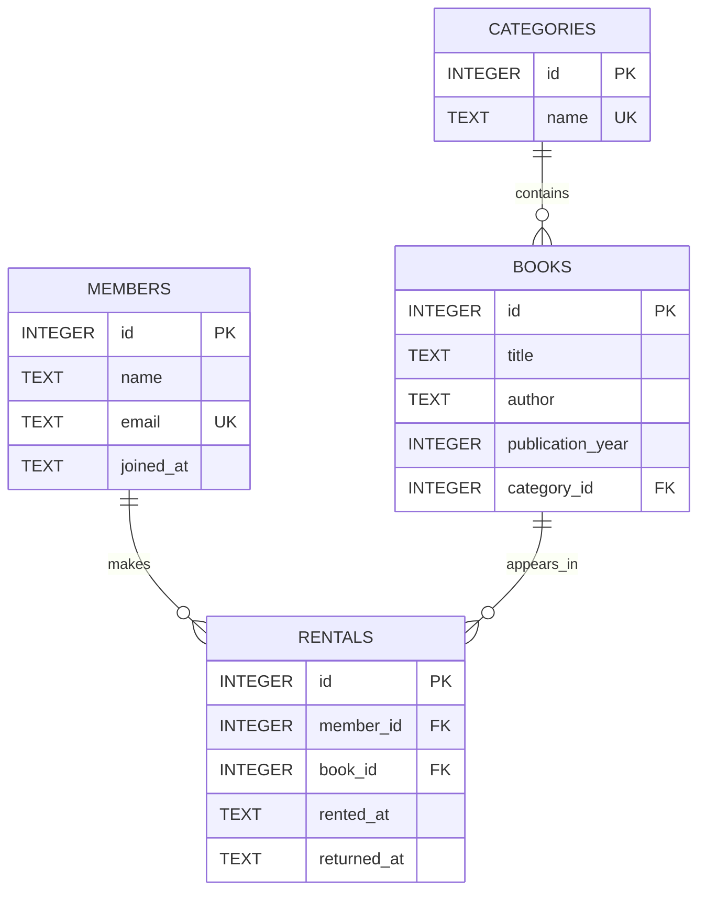

# B5-1 R01 — ERD Reference

Reference 도메인은 **도서 대여 관리 (Library Rental)** 입니다.

## 읽는 방법

- `CATEGORIES 1:N BOOKS`: 카테고리 하나에는 여러 도서가 속할 수 있습니다.
- `MEMBERS 1:N RENTALS`: 회원 한 명은 여러 번 대여할 수 있습니다.
- `BOOKS 1:N RENTALS`: 도서 한 권은 시간에 따라 여러 대여 기록을 가질 수 있습니다.

`rentals`는 회원과 도서를 직접 중복 저장하지 않고 `member_id`, `book_id` FK로 연결합니다. 이 구조가 JOIN 학습의 핵심입니다.

## SQLite 날짜 표현

Reference는 SQLite를 사용하므로 날짜/시간을 ISO 형태의 `TEXT` (`YYYY-MM-DD`, `YYYY-MM-DD HH:MM:SS`)로 저장합니다. ISO 형식을 일정하게 유지하면 기본적인 정렬과 비교가 문자열 순서와 시간 순서에서 일치합니다. 다른 DBMS를 선택하면 `DATE`, `DATETIME`, `TIMESTAMP` 등 전용 타입으로 바꿀 수 있습니다.
